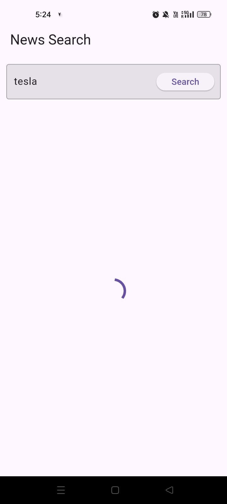
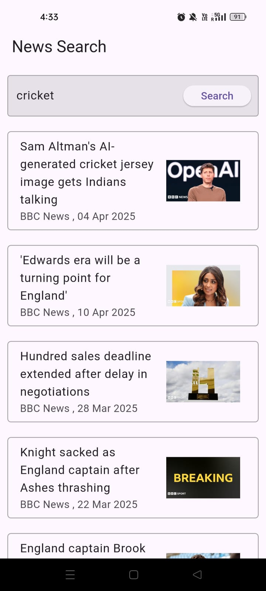
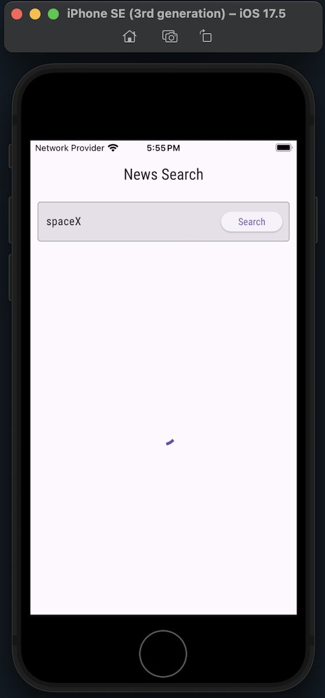
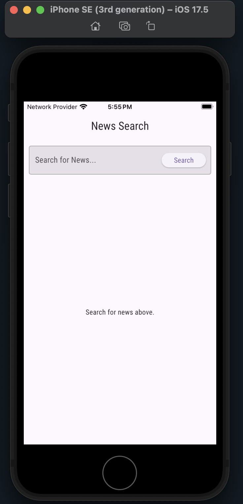
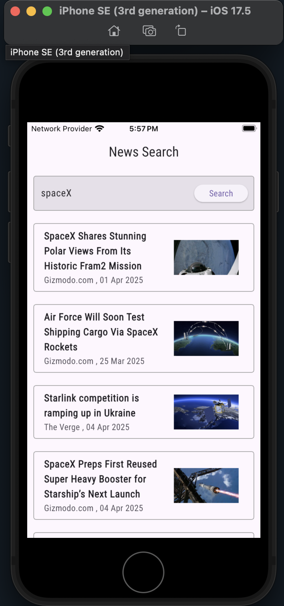
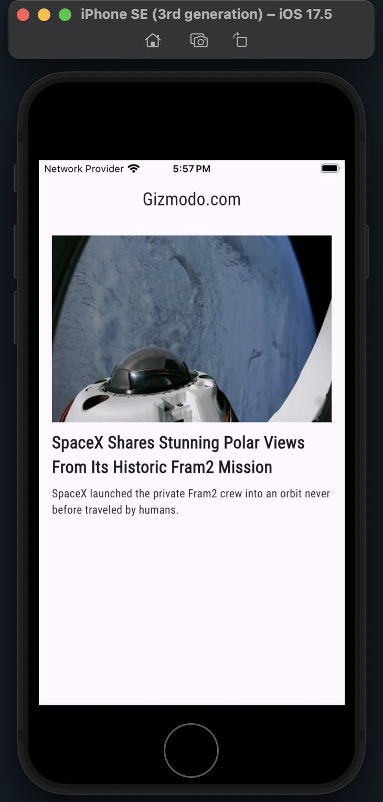

News Search App

A Flutter application to search and read news articles using the [NewsAPI](https://newsapi.org/v2/everything). Built with clean architecture using BLoC, Cubit, Service Layer, and REST Client patterns. Supports pagination, image placeholders, and caching of the last 5 search queries.

Features

- Search News by any keyword.
- Read articles with source and date.
- Infinite Scroll pagination.
- State Management using `flutter_bloc`.
- API key management with `.env`.
- Caching of last 5 search queries in session.
- Google Fonts applied globally.
- Image placeholders for broken/missing URLs.
- REST API client for scalable networking.

Architecture

- BLoC + Cubit for state management.
- Service Layer to encapsulate API logic.
- REST Client abstraction.
- Models to represent API response.
- Pages & Widgets separated for UI logic.

Setup

1. Clone the repo

git clone https://github.com/your-username/news_search_app.git
cd news_search_app

2. Add `.env` file

Create a file named `.env` at the root level:

NEWS_API_KEY=1653655327794df282a021b86381271e

Dependencies

pubspec.yaml

intl: ^0.19.0
flutter_bloc: ^8.1.6
http:
flutter_dotenv: ^5.1.0
flutter_screenutil: ^5.9.0
google_fonts:
path_provider_android: ^2.2.2

Install them using:

flutter pub get

3. For Android

- flutter run

4. For iOS

- cd ios
- pod install
- cd ..
- open -a Simulator
- flutter run

Android Screenshots

Loading State

Searched List View

News Details Views

Screen Recording
[recording.mp4](screenshots/screenshots_android/recording.mp4)

iOS Screenshots

Loading State

Searched View

News Details View

Folder Structure

lib/
│
├── api/                  # REST client abstraction
├── cubit/                # BLoC state management
├── models/               # Data models
├── pages/                # UI screens & widgets
├── services/             # Business logic and API layer
└── main.dart             # App entry point

